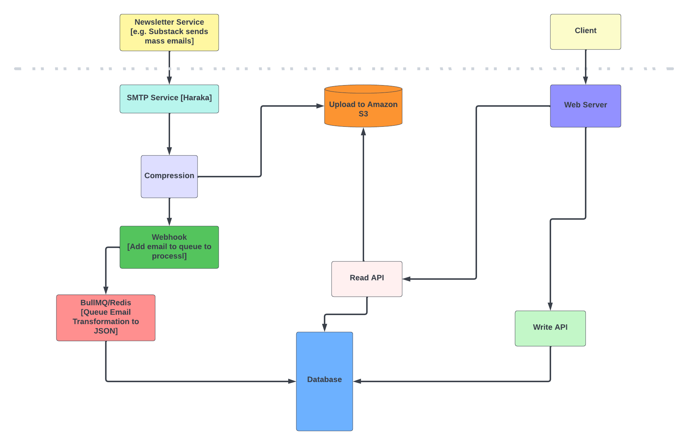

# Rua Backend

Rua is a platform that allows users to receive all their newsletter issues in one place. 
---
This doc outlines the whole codebase, system design, stack used to create the backend.

### System Design

### Stack
- [Node.js](https://nodejs.org/en/)
- [Express](https://expressjs.com/)
- [Graphql](https://graphql.org/)
- [Prisma](https://www.prisma.io/)
- [Postgres](https://www.postgresql.org/)
- [AWS](https://aws.amazon.com/)

### Codebase
- `aws_plugin/aws-s3-queue.js`: This is my S3 plugin that allows the Haraka SMTP server setup on Amazon to easily upload the emails to Amazon S3 on received.

- `bullmq/config.js`: Connects to my Redis instance and create a queue to handles
    - Converting of emails which are in Zip format to JSON, making it easier to render on the client side
    - Save the parsed email to the database

- `controllers/auth/authenticate.js`: Houses logic that enables logging into the platform.

- `controllers/category`: Holds CRUD functions that handle email issue categories

- `controllers/emails`: Holds a function that pushes a new email to the queue

- `controllers/feed`: Holds CRUD functions that handle issues received from different sources.

- `controllers/plan`: Holds CRUD functions that handle premium plans

- `controllers/subscription`: Holds CRUD functions that handle source subscriptions

- `controllers/validator`: Holds validation functions to prevent duplicate issued emails from Rua.

- `graphql/resolvers.js`: Holds all the resolvers for the GraphQL schema.

- `graphql/type-defs.js`: Holds the GraphQL type definitions.

- `helpers/jwt.js`: Holds the JWT helper functions.

- `helpers/password.js`: Holds the password helper functions.

- `middleware/auth/index.js`: Holds the authentication middleware that handles checking if the `Authorization` header is present to protecting certain `GraphQL` queries.

- `middleware/aws/index.js`: Holds the AWS middleware that handles reading emails from S3.

- `prisma`: Houses my database migrations and database schema.

- `rcpt_to_plugin`: Holds a Haraka plugin that allows me to prevent emails received for users don't exist in the Rua database.

- `routes/events`: Houses all webhook API endpoints, i.e. `new-email` event and soon a `premium-plan` event.

- `routes/validator`: Houses all the validator API endpoints. example there is an endpoint to check if an issued Rua email exists.

- `s3_utils`: Holds all functions that interact with AWS S3 example:
    - converting email zip file to JSON object, 
    - deleting processed email zips from S3
    - uploading the processed email json to S3
- `services/email.js`: Holds functions that enable sending out transactional emails to users.
- `template/issues`: Holds javascript templates and static HTML file that represent all the transactional emails I will send out to users.
- `server.js`: entry file to the backend.